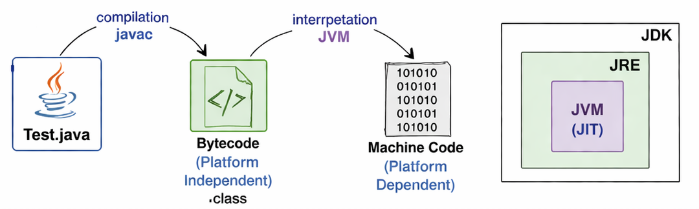
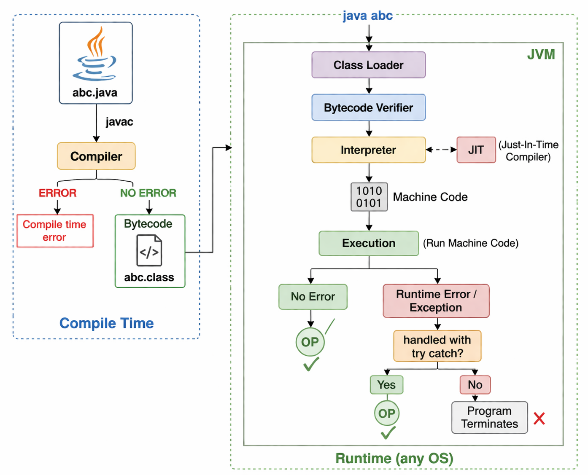

# Java Basics

## How Java Works — Execution Flow, JVM, JRE & JDK

---

## 1. Java Program Execution Flow

Java follows a **two-step execution process** — first compilation, then interpretation.


_Figure 1: Java Source → Bytecode → Machine Code_

### Step 1 — Compile Time (`javac`)

```
abc.java  ──(javac)──►  Compiler  ──► abc.class (Bytecode)
```

- You write Java source code in a `.java` file.
- The `javac` compiler compiles it.
- **If ERROR →** Compile Time Error (fix before proceeding).
- **If NO ERROR →** Bytecode is generated as a `.class` file.
- Bytecode is **platform independent** — it can run on any OS.

### Step 2 — Runtime (JVM)

```
abc.class  ──►  Class Loader  ──►  Bytecode Verifier  ──►  Interpreter (+JIT)  ──►  Machine Code  ──►  Execution
```

Inside the **JVM**, at runtime:

1. **Class Loader** — loads the `.class` bytecode file into memory.
2. **Bytecode Verifier** — checks the bytecode for security and validity.
3. **Interpreter** — reads and executes bytecode line by line.
4. **JIT (Just-In-Time Compiler)** — speeds up execution by compiling frequently used bytecode directly into native machine code.
5. **Machine Code** — the final binary (1010 0101) that the OS can run.
6. **Execution** — machine code runs on the host OS.

### Execution Outcomes

| Result                       | What Happens                         |
| ---------------------------- | ------------------------------------ |
| ✅ No Error                  | Output (OP) is produced successfully |
| ⚠️ Runtime Error / Exception | JVM throws an exception              |
| ✅ Handled with `try-catch`  | Output (OP) is still produced        |
| ❌ Not Handled               | Program Terminates                   |


_Figure 2: Complete Java Execution Flow — Compile Time + Runtime (JVM)_

---

## 2. JDK, JRE & JVM

```
┌──────────────────────────────┐
│            JDK               │
│  ┌────────────────────────┐  │
│  │          JRE           │  │
│  │  ┌──────────────────┐  │  │
│  │  │   JVM  (JIT)     │  │  │
│  │  └──────────────────┘  │  │
│  └────────────────────────┘  │
└──────────────────────────────┘
```

### JVM — Java Virtual Machine

- The **engine** that runs Java bytecode.
- Converts bytecode → machine code at runtime.
- Contains: **Class Loader**, **Bytecode Verifier**, **Interpreter**, **JIT Compiler**.
- **Platform dependent** — a different JVM exists for each OS (Windows, Linux, Mac).
- Makes Java **Write Once, Run Anywhere** by abstracting the OS.

### JRE — Java Runtime Environment

- JRE = **JVM** + **Libraries** (pre-built Java class libraries).
- Used to **run** Java programs.
- If you only want to run (not develop) Java apps → install JRE.

### JDK — Java Development Kit

- JDK = **JRE** + **Development Tools** (`javac`, `javadoc`, `javap`, debugger, etc.)
- Used to **develop and compile** Java programs.
- If you want to write and compile Java code → install JDK.

| Component | Contains                       | Used For             |
| --------- | ------------------------------ | -------------------- |
| **JVM**   | Interpreter, JIT, Class Loader | Running bytecode     |
| **JRE**   | JVM + Libraries                | Running Java apps    |
| **JDK**   | JRE + Dev Tools (`javac` etc.) | Developing Java apps |

---

## 3. Key Concepts

### Platform Independence

```
Test.java ──(javac)──► Bytecode (.class) ──(JVM)──► Machine Code
                       Platform Independent          Platform Dependent
```

- Bytecode is **not tied to any OS** — it's the same `.class` file everywhere.
- The **JVM translates** bytecode into the specific machine code for the OS it's running on.
- This is why Java is called **"Write Once, Run Anywhere (WORA)"**.

### JIT Compiler (Just-In-Time)

- Works alongside the Interpreter inside the JVM.
- Instead of interpreting bytecode line-by-line every time, JIT **compiles hot (frequently used) code** into native machine code once and caches it.
- Makes Java programs run **significantly faster** over time.

### Compile Time vs Runtime Errors

| Error Type                    | When It Occurs             | Example                                                  |
| ----------------------------- | -------------------------- | -------------------------------------------------------- |
| **Compile Time Error**        | During `javac` compilation | Syntax error, missing semicolon                          |
| **Runtime Error / Exception** | During program execution   | `NullPointerException`, `ArrayIndexOutOfBoundsException` |

---

## 4. Quick Summary

```
You write:      abc.java
Compile with:   javac abc.java  →  abc.class (Bytecode)
Run with:       java abc        →  JVM executes the bytecode

JVM Pipeline:
  Class Loader → Bytecode Verifier → Interpreter ←→ JIT → Machine Code → Execution
```

> 💡 **Remember:**
>
> - `javac` = compiler (Compile Time)
> - `java` = launcher that starts the JVM (Runtime)
> - **JDK** ⊃ **JRE** ⊃ **JVM**
