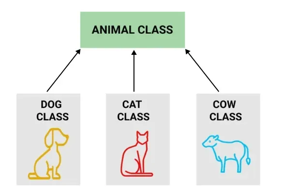
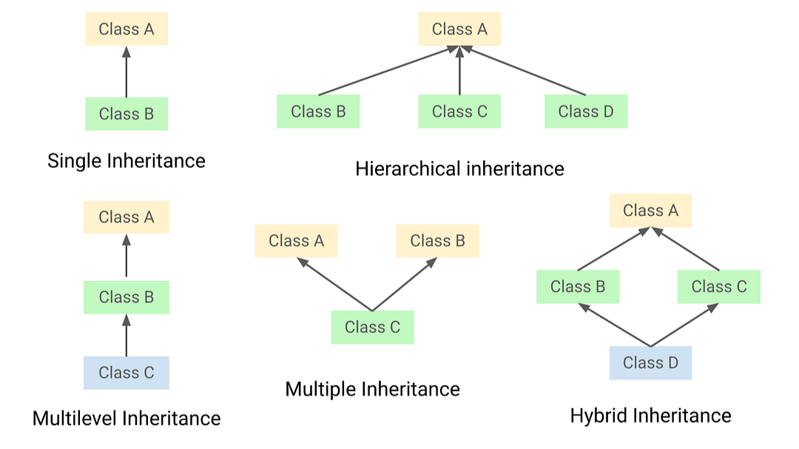
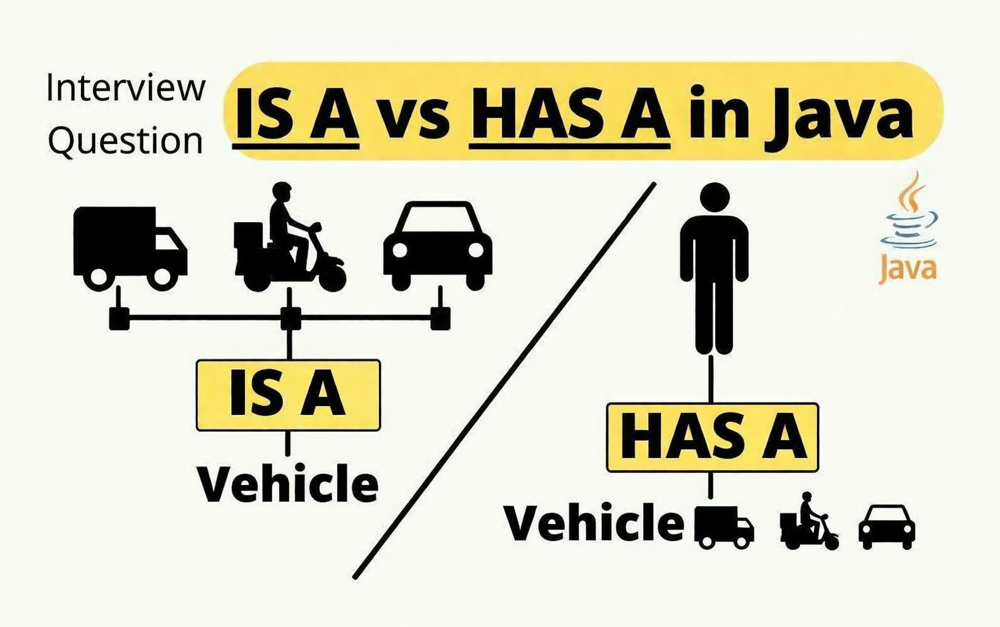

# Inheritance & Class Relationships in Java

---

## 1. Inheritance

Inheritance is the mechanism by which one class (**child/subclass**) acquires all the properties and behaviors of another class (**parent/superclass**). It establishes an **Is-A** relationship between classes.

- Inheriting the properties of a parent class into the child class.
- The child class inherits methods and fields defined in the parent class.
- Promotes code reuse and supports runtime polymorphism.


_Figure 1: Animal Class Hierarchy — Dog, Cat, and Cow inherit from Animal_

---

### Advantages

1. **Code Reusability** — child classes can use methods/fields of the parent without rewriting them.
2. **Runtime Polymorphism** — allows method overriding so each subclass can provide its own behavior.
3. **Cost Cutting** — reduces development effort by sharing common logic.
4. **Reduced Redundancy** — no need to repeat the same code in multiple classes.

### Disadvantages

- **Tight Coupling** — child classes depend heavily on the parent class.
- Any change in the parent class affects **all** child classes, potentially breaking them.

---

### What is NOT Inherited by the Child Class?

1. **Constructors** — they are not inherited; each class has its own constructors.
2. **Private members** — private fields and methods of the parent are not directly accessible in the child class.

> 💡 **Note:** The parent class of **ALL** classes in Java is the **`Object`** class.

---

## 2. Types of Inheritance


_Figure 2: Types of Inheritance in Java and OOP_

| Type         | Notation     | Supported in Java |
| ------------ | ------------ | :---------------: |
| Single       | A → B        |        ✅         |
| Multilevel   | A → B → C    |        ✅         |
| Hierarchical | A → B, C     |        ✅         |
| Multiple     | A, B → C     |        ❌         |
| Hybrid       | A → B, C → D |        ❌         |

### Why Multiple & Hybrid Inheritance are NOT Allowed in Java

Consider two classes **A** and **B**, each having a method with the same name, and a third class **C** that inherits from both. When we call `objC.method()`, the compiler cannot determine which version to use — from A or from B.

This ambiguity is known as the **Diamond Problem**.

> ⚠️ Java solves this by **disallowing multiple class inheritance**. Interfaces can be used to achieve similar behavior without ambiguity.

---

## 3. Is-A Relationship (Inheritance)

The **Is-A** relationship is established using the `extends` keyword in Java. It represents a parent-child (**blood relation**) between classes.

```
       Bird          ← Parent Class
         ↑
      extends
         |
      Sparrow        ← Child Class
```

- **Keyword:** `extends`
- Tightly coupled relationship
- Supports: Single, Multilevel, Hierarchical, Multiple, and Hybrid inheritance

**Example:**

```java
class Bird {
    void fly() {
        System.out.println("Bird is flying");
    }
}

class Sparrow extends Bird {  // Sparrow Is-A Bird
    void sing() {
        System.out.println("Sparrow is singing");
    }
}
```

---

## 4. Has-A Relationship (Association)

The **Has-A** relationship is a **non-blood** relationship between classes. Instead of using `extends`, one class holds a **reference (object)** of another class.

- **No `extends` keyword** required.
- Access methods/attributes via object reference.
- **Prevents tightly coupled code.**
- Example: `Student` Has-A `name`, `Student` Has-A `roll`

### Types of Has-A Relationship

#### 4.1 Aggregation — Weak Bonding ◇

The contained object **can exist independently** of the container object.

```
Car ◇────── MusicPlayer
```

- **Car** Has-A **music_player** — the music player is not essential for the car to run.
- If the `Car` (container) is destroyed, the `MusicPlayer` (contained) can **still exist**.
- Represented by a **hollow diamond** in UML diagrams.

```java
class MusicPlayer {
    void play() { System.out.println("Playing music"); }
}

class Car {
    MusicPlayer musicPlayer;  // Aggregation — weak bonding

    Car(MusicPlayer mp) {
        this.musicPlayer = mp;
    }
}
```

#### 4.2 Composition — Strong Bonding ◆

The contained object **cannot exist without** the container object.

```
Car ◆────── Engine
```

- **Car** Has-A **Engine** — the engine makes no sense without the car context.
- If the `Car` (container) is destroyed, the `Engine` (contained) also **ceases to exist**.
- Represented by a **filled diamond** in UML diagrams.

```java
class Car {
    Engine engine;  // Composition — strong bonding

    Car() {
        this.engine = new Engine();  // Engine created inside Car
    }
}

class Engine {
    void start() { System.out.println("Engine started"); }
}
```

---

## 5. Quick Reference Summary

| Relationship           | Keyword          | Coupling         | Example                 |
| ---------------------- | ---------------- | ---------------- | ----------------------- |
| **Is-A** (Inheritance) | `extends`        | Tightly Coupled  | `Sparrow extends Bird`  |
| **Has-A** Aggregation  | Object Reference | Weakly Coupled   | `Car` has `MusicPlayer` |
| **Has-A** Composition  | Object Reference | Strongly Coupled | `Car` has `Engine`      |

---

## 6. Types of Relationships Between Classes



### 1. Is-A (Inheritance)

- Tightly coupled with `extends` keyword
- Blood relation
- Types: Simple, Multilevel, Hierarchical, Multiple, Hybrid

### 2. Has-A (Association)

- Not a blood relation
- Access the methods and attributes of another class using its object — no need for `extends`
- Prevents tight coupling

| Sub-type        | Bonding  | Container Destroyed →                |
| --------------- | -------- | ------------------------------------ |
| **Aggregation** | Weak ◇   | Contained object **can** still exist |
| **Composition** | Strong ◆ | Contained object **cannot** exist    |
